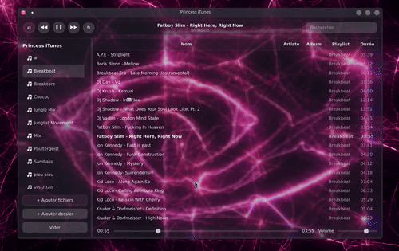

# Princess iTunes 🎵

A modern music player for Linux inspired by the classic iTunes experience.

Princess iTunes focuses on a beautiful library, smooth navigation and an elegant desktop experience while remaining lightweight and open source.


## Demo



---

## Features

### 🎶 Music Library

- Import local music folders
- Album and artist browsing
- Playlist management
- Search library instantly
- Recently played
- Favorites

### 🎧 Playback

- Play / Pause / Next / Previous
- Shuffle
- Repeat
- Queue management
- Volume control
- Keyboard shortcuts

### 🎨 Interface

- Modern interface
- Dark & Light themes
- Album artwork
- Responsive layout
- Smooth animations

### 📚 Library Management

- Automatic library scan
- Metadata support
- Album grouping
- Artist grouping
- Genre browsing

### ⚡ Performance

- Fast startup
- Optimized library indexing
- Low memory usage
- Large collection support

---

## Roadmap

- [ ] Lyrics support
- [ ] Equalizer
- [ ] Podcasts
- [ ] Internet radio
- [ ] Last.fm integration
- [ ] MPRIS support
- [ ] Mini player
- [ ] Smart playlists

---

## Installation

```bash
git clone https://github.com/princessnvidia/princess-itunes.git

cd princess-itunes

pip install -r requirements.txt

python princess_itunes.py
```

---

## Screenshots

Coming soon.

---

## Technologies

- Python
- PySide6
- Qt6

---

## Philosophy

Princess iTunes aims to bring back the simplicity and elegance of classic desktop music players while embracing modern Linux technologies.

---

## License

MIT License
